# AtlasAI — Autonomous Multi-Agent Travel Operating System

<div align="center">

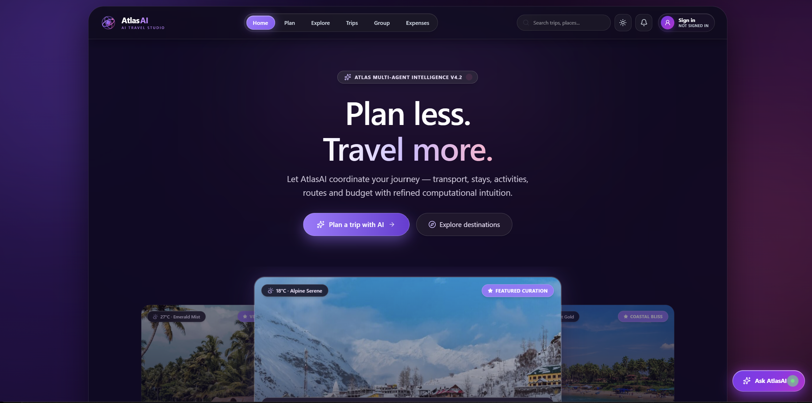

[](https://nodejs.org/)
[](https://react.dev/)
[](https://vitejs.dev/)
[](https://tailwindcss.com/)
[](https://www.sqlite.org/)
[](LICENSE)
[](https://atlas-ai-travel-planner.vercel.app/)

**An intelligent, multi-agent travel orchestration engine and interactive itinerary studio crafted in Liquid Glass aesthetic.**

[🚀 **Live Application**](https://atlas-ai-travel-planner.vercel.app/) • [Architecture](#-architecture) • [Quickstart](#-local-development-setup) • [Deploy for Free](#-production-deployment-guide)

</div>

---

## 🌟 Overview

**AtlasAI** is a full-stack, autonomous travel operating system that replaces static travel itineraries with real-time, multi-agent AI collaboration. When a user requests a journey, 5 specialized autonomous agents evaluate logistics, microclimates, transport routes, accommodations, and budget constraints in parallel, streaming their structured reasoning live to the user via Server-Sent Events (SSE).

Built with a custom **Liquid Glass** design system, AtlasAI features a dual-theme interface offering a futuristic deep dark glassmorphism and a warm retro cream light theme.

---

## 🤖 Multi-Agent Orchestration Pipeline

AtlasAI routes every trip request through a **9-agent staged pipeline**. Agents run sequentially or in parallel depending on their data dependencies, with an automatic critique-and-replan loop to ensure quality.

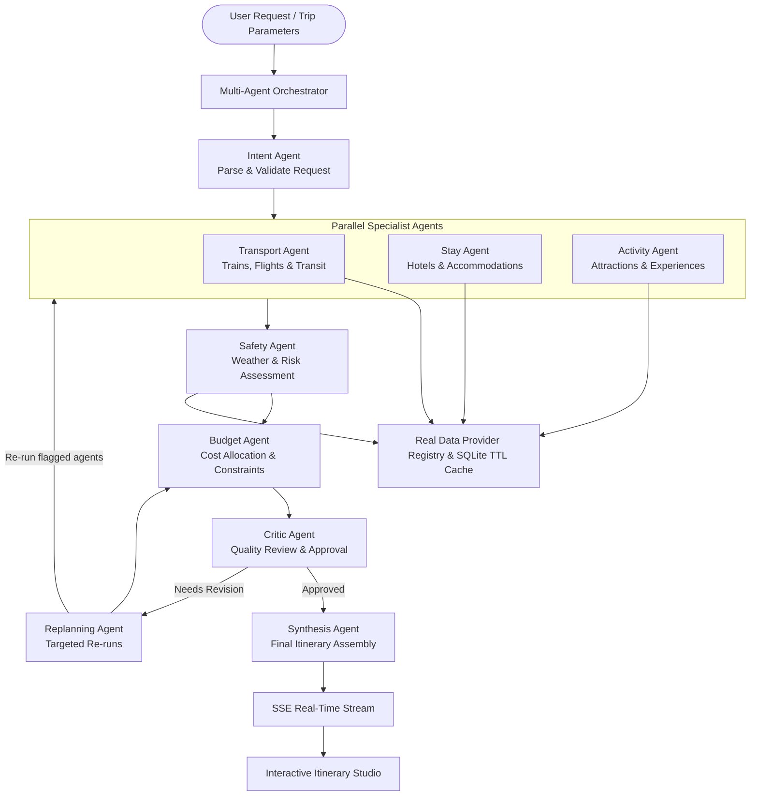

1. **Intent Agent**: Parses and validates the raw trip request — extracting destination, dates, travellers, budget, pace, dietary, and accessibility requirements before any other agent runs.
2. **Transport Agent**: Reconciles train corridors (RailRadar) and transit routes with schedule feasibility. Runs in parallel with Stay and Activity.
3. **Stay Agent**: Recommends hotels clustered near key destinations to minimize daily commute time. Runs in parallel with Transport and Activity.
4. **Activity Agent**: Identifies top sights, local experiences, and hidden gems using coordinate-first OpenTripMap geocoding. Runs in parallel with Transport and Stay.
5. **Safety Agent**: Evaluates live OpenWeather microclimates and risk factors using the transport routes and schedule selected by the parallel trio.
6. **Budget Agent**: Allocates daily costs (stay, meals, transit, activities) against user-defined ceilings, running after all data agents to have complete cost inputs.
7. **Critic Agent**: Reviews the assembled plan for quality, consistency, and constraint satisfaction. If issues are found, it triggers the Replanning Agent.
8. **Replanning Agent**: Identifies which specific agents need to re-run and with what corrections, enabling targeted fixes without restarting the whole pipeline.
9. **Synthesis Agent**: Assembles the final, approved itinerary and streams it to the client via SSE once the Critic is satisfied.

---

## ✨ Key Features

- **⚡ Real-Time SSE Streaming**: Watch each agent evaluate options, explain trade-offs, and synthesize the final itinerary in real time.
- **🗺️ Interactive Itinerary Studio**:
  - Daily capsule tabs for multi-day plans.
  - Category-tagged timeline stops (Adventure, Stay, Food, Transit).
  - Stop detail drawers with interactive map cues and actionable notes.
  - **Allocated Day Cost Progress Tracker**: Visualizes stay, meals, transit, and activity spend with remaining daily headroom.
  - **Live Microclimate Weather Widget**: Real-time temperature, conditions, humidity, and wind via OpenWeatherMap.
- **👥 Group Travel Hub & Chat**:
  - Shareable group trip invite codes.
  - Real-time group chat and trip coordination.
  - Expense splitting with per-member breakdowns.
- **🛡️ Emergency & Safety Suite**:
  - Live location sharing toggle.
  - Immediate SOS button and local emergency service locator (police, hospitals, embassies).
- **🎨 Liquid Glass Dual-Theme System**:
  - **Dark Mode**: Cybernetic glassmorphism with subtle glow rings and backdrop blurs.
  - **Warm Cream Retro Light Mode**: Soft antique paper aesthetic with rich contrast for daylight readability.
- **🔒 Zero-Key-Leakage Security Model**:
  - 100% of sensitive API keys stay isolated on the backend.
  - Frontend communicates purely through authenticated REST and SSE endpoints.
  - Graceful fallback: If an external API key is missing, AtlasAI seamlessly falls back to high-fidelity curated data.

---

## 📸 Interface Showcase

AtlasAI features a custom **Liquid Glass** aesthetic with dual-theme immersion: Cybernetic Dark and Retro Warm Cream Light.

### 1. Monumental Hero & 3D Destination Carousel
| Cybernetic Dark | Retro Warm Cream |
| :---: | :---: |
|  | 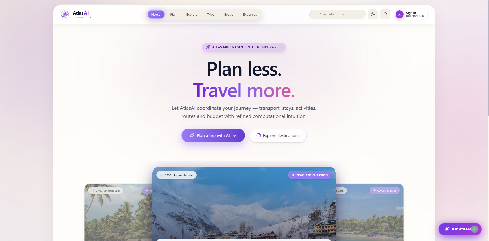 |

### 2. Autonomous Itinerary Studio & Microclimate Telemetry
| Cybernetic Dark | Retro Warm Cream |
| :---: | :---: |
| 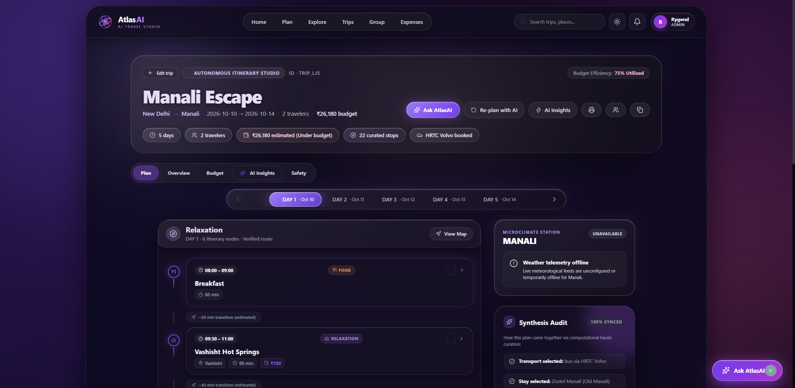 | 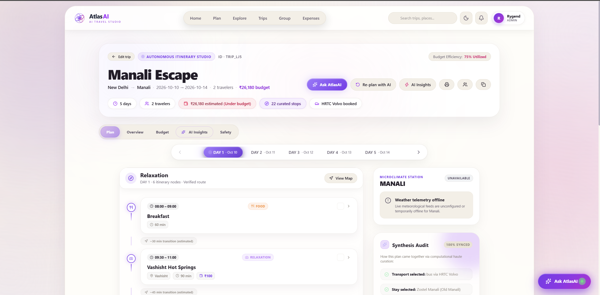 |

### 3. Plan Trip & Atmospheric Parameters
| Cybernetic Dark | Retro Warm Cream |
| :---: | :---: |
| 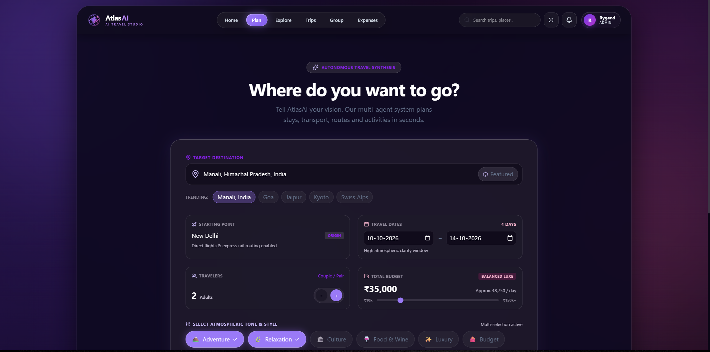 | 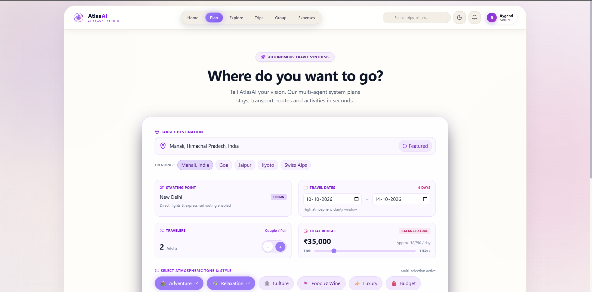 |

### 4. Global Sensing & Explore Hub
| Cybernetic Dark | Retro Warm Cream |
| :---: | :---: |
| 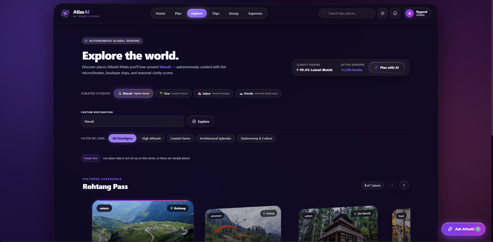 | 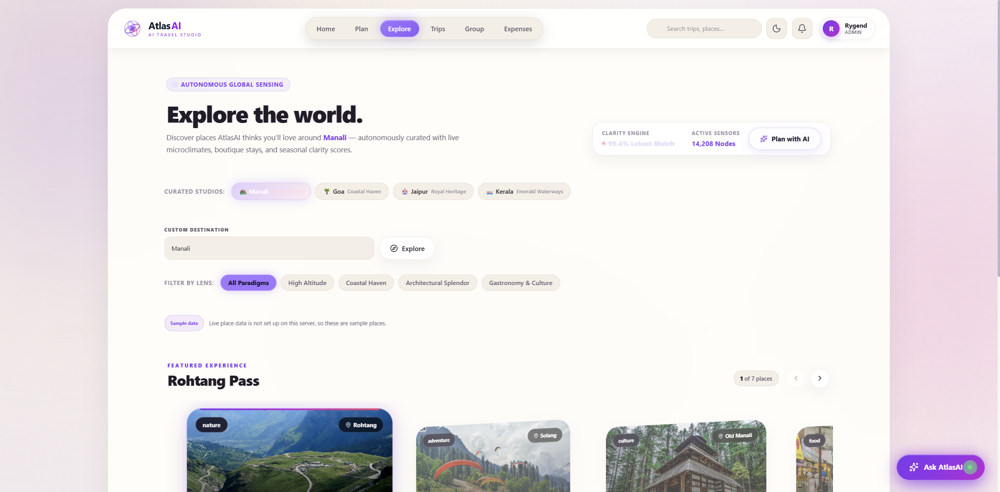 |

### 5. Autonomous Budget Intelligence & Spending Allocation
| Cybernetic Dark | Retro Warm Cream |
| :---: | :---: |
| 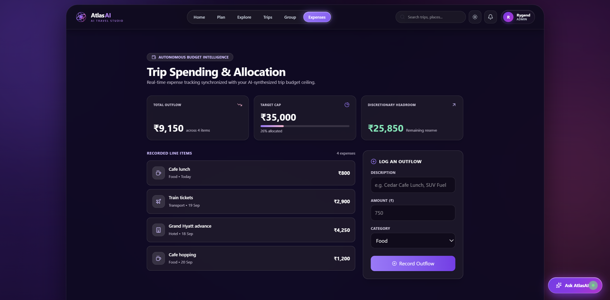 | 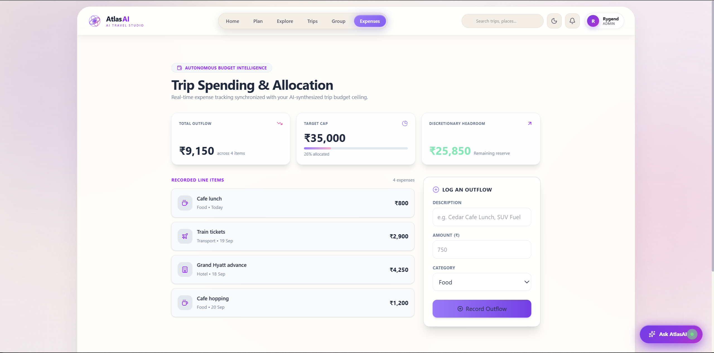 |

### 6. Group Collaboration & Real-Time Sync
| Group Travel Hub & Chat | Instant Notification Drawer |
| :---: | :---: |
| 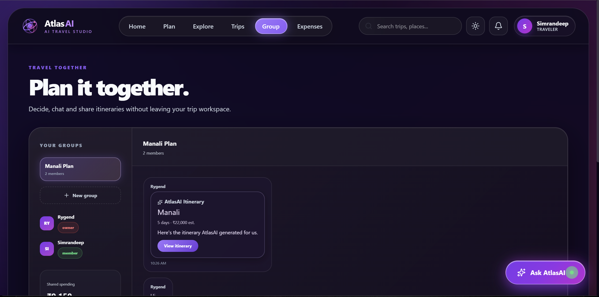 | 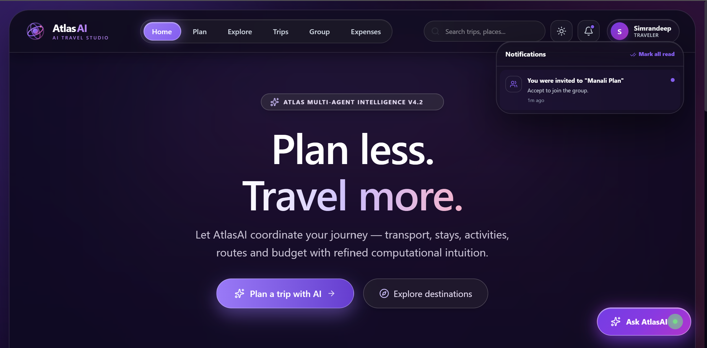 |

---

## 🏗️ Architecture & Data Layer

```
AtlasAI/
├── backend/
│   ├── src/
│   │   ├── agents/          # Multi-agent orchestrator & individual agent logic
│   │   ├── config/          # Environment configuration & security checks
│   │   ├── db/              # SQLite schema, migrations & seed data
│   │   ├── middleware/      # Auth, rate limiting & error handling
│   │   ├── normalizers/     # Unified canonical format for all providers
│   │   ├── providers/       # OpenTripMap, OpenWeather, RailRadar, etc.
│   │   ├── routes/          # Express REST API & SSE streaming endpoints
│   │   ├── services/        # Business logic & SQLite TTL caching
│   │   └── tools/           # Agent execution tools (weather, routes, hotels)
│   ├── test/                # Automated node:test suite (220+ tests)
│   └── package.json         # Node.js 20/22 runtime configuration
│
├── travel-planner/          # React 19 Frontend
│   ├── components/          # Liquid Glass UI components & drawers
│   ├── context/             # Auth, Booking, Expense, and Notification contexts
│   ├── pages/               # Itinerary, PlanTrip, Dashboard, GroupHub, etc.
│   ├── public/              # SVGs, icons, and high-res destination assets
│   ├── services/            # Client-side API abstraction & SSE hooks
│   ├── vercel.json          # SPA routing rewrite configuration for Vercel
│   └── package.json         # Vite 8 & Tailwind CSS v4 setup
└── README.md
```

---

## 🚀 Local Development Setup

### Prerequisites
- **Node.js**: `v20.x` or `v22.x` (Recommended: `v22.23.3`. Note: avoid Node 24 due to `better-sqlite3` native bindings).
- **npm** or **pnpm**

### 1. Clone the Repository
```bash
git clone https://github.com/BrownPanther/AtlasAI.git
cd AtlasAI
```

### 2. Backend Setup
```bash
cd backend
npm install

# Create environment configuration
cp .env.example .env
```

Open `backend/.env` and configure your settings:
```env
PORT=4000
NODE_ENV=development
JWT_SECRET=super-secret-random-32-character-key
CORS_ORIGIN=http://localhost:5173

# Optional: Add free external provider keys (AtlasAI works with sample data if left empty)
WEATHER_API_KEY=your_openweathermap_key
ATTRACTIONS_API_KEY=your_opentripmap_key
TRAINS_API_KEY=your_railradar_key
MAPS_API_KEY=your_openrouteservice_key
```

Run the backend server:
```bash
npm run dev
# Server boots at http://localhost:4000 (SQLite database initialized automatically)
```

Run the backend tests:
```bash
npm test
```

### 3. Frontend Setup (New Terminal)
```bash
cd travel-planner
npm install

npm run dev
# Open http://localhost:5173 in your browser
```

---

## 🌐 100% Free Production Deployment Guide

Deploy AtlasAI completely for free in under 10 minutes using **Render** (Backend) and **Vercel** (Frontend).

### Part A: Deploy Backend on Render (Free Tier)

1. Create a free account at [render.com](https://render.com).
2. Click **New +** → **Web Service**.
3. Connect your GitHub repository (`AtlasAI`).
4. Configure the Web Service settings:
   - **Name**: `atlasai-api` (or your preferred name)
   - **Root Directory**: `backend`
   - **Runtime**: `Node`
   - **Build Command**: `npm install`
   - **Start Command**: `node src/server.js`
   - **Instance Type**: `Free`
5. Click **Advanced** → **Add Environment Variable**:
   | Key | Value | Notes |
   |---|---|---|
   | `NODE_VERSION` | `22` | Critical for `better-sqlite3` compatibility |
   | `NODE_ENV` | `production` | Enables production optimizations |
   | `JWT_SECRET` | *(generate a random 32+ char string)* | Security token secret |
   | `CORS_ORIGIN` | `https://your-atlasai.vercel.app` | Allow your Vercel frontend |
   | `WEATHER_API_KEY` | *(your key or leave blank)* | Optional free OpenWeatherMap key |
   | `ATTRACTIONS_API_KEY`| *(your key or leave blank)* | Optional free OpenTripMap key |
6. Click **Deploy Web Service**.
7. Note down your backend URL (e.g., `https://atlasai-api.onrender.com`).

---

### Part B: Deploy Frontend on Vercel (Free Tier)

1. Create a free account at [vercel.com](https://vercel.com).
2. Click **Add New…** → **Project**, and import your `AtlasAI` repository.
3. Configure the Project settings:
   - **Framework Preset**: `Vite`
   - **Root Directory**: Click edit and choose `travel-planner`
   - **Build Command**: `npm run build`
   - **Output Directory**: `dist`
4. Expand **Environment Variables**:
   - Name: `VITE_API_URL`
   - Value: `https://atlasai-api.onrender.com/api` *(Your Render backend URL with `/api` appended)*
5. Click **Deploy**.
6. Vercel automatically applies `travel-planner/vercel.json` for seamless client-side single-page app routing. Your app is live!

---

## 🔐 Environment Variables Reference

| Variable | Scope | Required | Description |
|---|---|---|---|
| `PORT` | Backend | No | API port (default `4000`) |
| `NODE_ENV` | Backend | Yes | `development` or `production` |
| `JWT_SECRET` | Backend | Yes | Secret used to sign user auth tokens |
| `CORS_ORIGIN` | Backend | Yes | Comma-separated allowed origins (e.g. `http://localhost:5173,https://atlasai.vercel.app`) |
| `WEATHER_API_KEY` | Backend | No | OpenWeatherMap API key (falls back to weather sample data) |
| `ATTRACTIONS_API_KEY`| Backend | No | OpenTripMap API key (falls back to curated attractions) |
| `TRAINS_API_KEY` | Backend | No | RailRadar API key (falls back to sample rail corridors) |
| `MAPS_API_KEY` | Backend | No | OpenRouteService API key |
| `AMADEUS_API_KEY` | Backend | No | Amadeus test API key for flights/hotels |
| `VITE_API_URL` | Frontend| Yes (Prod) | Full URL to backend `/api` endpoint |

---

## 📄 License

This project is licensed under the MIT License — see the [LICENSE](LICENSE) file for details.
